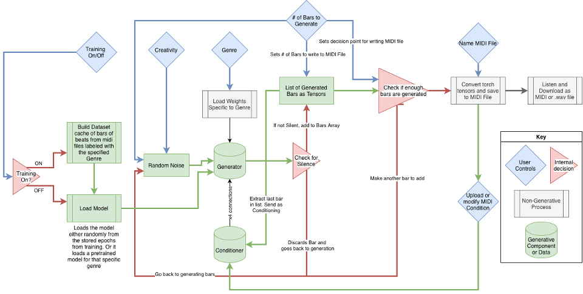

# Drum Beat Generator 

## Summary 
This project is inspired by the common Casual Creators on the internet with an objective to experiment with new musical ideas. This system takes a few selectable user driven inputs based on genre, and the desired temporal length of the artifact. With those limited options, Genre Beat Generator composes a drumbeat within the desired number of musical “bars” based on the selected genre. In turn, new models can be trained on genre subsets of data. 

## Architecture
The model architecture is based on MIDI-net, a CNN-based GAN that treats a Piano Roll as a binary image. MIDI-net (Li-Chia Yang, 2017) is one of many different symbolic generative adversarial networks like MuseGAN. This Piano Roll is a symbolic way to display musical notes, typically from MIDI files, in music production. It was originally designed to generate melodies from scratch/noise. Its architecture is designed to use prior musical knowledge of previously generated or real bars through multiple iterations to generate a continuous melody.
 
The Model contains a Generator, Discriminator, and Conditioner. The Generator takes an input noise vector and generates a bar of symbolic music represented as a piano roll. The Discriminator determines if that Piano Roll is an accurate representation of a real bar of symbolic music. 

The Input to the Generator is a vector of random Gaussian white noise, and its output is an h-by-w binary matrix representing the Piano Roll image. The Input to the Conditioner is either a real bar during training or the previous bar generated by the Generator by concatenating several partially convolved tensors that influence generation in the different transposed convolutional layers of the Generator. The Input to the Discriminator is the matrix from the Generator and a matrix of a real bar. Its output is 0 for fake and 1 for real. 

Each genre specific model is trained by a specialized Minimax Feature Matching function that calculates the total of two differences in the expected outputs of fake and real and the differences of the expected outputs of the first convolutional layer in the generator and discriminator. The training of this model should make the sum of those two differences as close to 0 as possible. 

After some initial testing with the Aria-MIDI dataset. Google’s Grooveset dataset was combined with some Apple Loops MIDI files. Like Aria-MIDI, Grooveset is unquantized, but Apple Loops is. Periodically adding Apple Loops sampling helped stabilize some of the pretrained models on top of some quantization steps.



## Evaluation of Typicality 

This model found some typicality within the genre's possibility space; 4 out of 9 beats were identified by most participants. Almost all participants (88.9%) reported finding 1 of the 9 beats, and a majority (62.5%) rated 4 of the 9 beats as novel. This data supports the quality and novelty of the casual creator. Results from Q6 indicate they would use at least one of the beats, and the quality and novelty of the system are viewed favorably amongst the participants.  However, with these positive results, the open-ended question clarified the need to improve quality. 

In the written response section, most participants noted that the tempo remained the same across generations, identifying a key flaw and limitation of fixed dimensions in CNNs. More than one participant described an over-reliance on syncopation, which is novel, but at the cost of quality. Additionally, others say the drumbeats sound like “fills” or like they're abandoning the beat. These comments indicate that the model explores the possibility space with little typicality, because some of the beats are too complex or random. The model appears to lack domain competence within the possibility space, as it can distribute MIDI notes with an average metrical understanding but minimal rhythmic stability. Analyzing this, MIDI-net’s listening study is often rated as less repetitive than RNN counterparts (Li-Chia Yang, 2017). This system then prioritizes novelty over the stability and repetition needed for rhythm, which can be ideal for melody but not necessarily beat creation for drumbeats.

# Using `Ferraro_Final_project.ipynb` in Colab

This repository’s main notebook is **`Ferraro_Final_project.ipynb`**.

### Open and run (Google Colab)
1. Navigate to `Ferraro_Final_project.ipynb` in this repository.
2. Click **Open in Colab**.
- Main Project: <a href="https://colab.research.google.com/github/jof-edu-smc/drum-beat-generator/blob/main/Ferraro_Final_Project.ipynb" target="_parent"></a>   
 - Evaluation / Listening Survey: <a href="https://colab.research.google.com/github/jof-edu-smc/drum-beat-generator/blob/main/suvery.ipynb" target="_parent"></a>
3. In Colab, select **Runtime → Change runtime type** and enable **GPU** (recommended).
4. Run cells top-to-bottom using **Runtime → Run all**.

### Open and run (local Jupyter)
1. Clone the repository and open a terminal in the project folder.
2. Install dependencies listed in the notebook (or project environment file, if present).
3. Launch Jupyter:
    ```bash
    jupyter notebook
    ```
4. Open `Ferraro_Final_project.ipynb` and run all cells in order.

### Notes
- Do not skip setup/import cells.
- If dataset/model download cells are included, run them before training/inference cells.
- Re-run from a clean runtime if you change core configuration values.

## Citations

```bibtex
@inproceedings{bradshawaria,
  title={Aria-MIDI: A Dataset of Piano MIDI Files for Symbolic Music Modeling},
  author={Bradshaw, Louis and Colton, Simon},
  booktitle={International Conference on Learning Representations},
  year={2025},
  url={https://openreview.net/forum?id=X5hrhgndxW}, 
}

@inproceedings{groove2019,
     Author = {Jon Gillick and Adam Roberts and Jesse Engel and Douglas Eck and David Bamman},
     Title = {Learning to Groove with Inverse Sequence Transformations},
     Booktitle = {International Conference on Machine Learning (ICML)},
     Year = {2019},
}

@misc{yang_midinet_2017,
     title = {{MidiNet}: A Convolutional Generative Adversarial Network for Symbolic-domain Music Generation},
     url = {http://arxiv.org/abs/1703.10847},
     doi = {10.48550/arXiv.1703.10847},
     shorttitle = {{MidiNet}},
     abstract = {Most existing neural network models for music generation use recurrent neural networks. However, the recent {WaveNet} model proposed by {DeepMind} shows that convolutional neural networks ({CNNs}) can also generate realistic musical waveforms in the audio domain. Following this light, we investigate using {CNNs} for generating melody (a series of {MIDI} notes) one bar after another in the symbolic domain. In addition to the generator, we use a discriminator to learn the distributions of melodies, making it a generative adversarial network ({GAN}). Moreover, we propose a novel conditional mechanism to exploit available prior knowledge, so that the model can generate melodies either from scratch, by following a chord sequence, or by conditioning on the melody of previous bars (e.g. a priming melody), among other possibilities. The resulting model, named {MidiNet}, can be expanded to generate music with multiple {MIDI} channels (i.e. tracks). We conduct a user study to compare the melody of eight-bar long generated by {MidiNet} and by Google’s {MelodyRNN} models, each time using the same priming melody. Result shows that {MidiNet} performs comparably with {MelodyRNN} models in being realistic and pleasant to listen to, yet {MidiNet}’s melodies are reported to be much more interesting.},
     number = {{arXiv}:1703.10847},
     publisher = {{arXiv}},
     author = {Yang, Li-Chia and Chou, Szu-Yu and Yang, Yi-Hsuan},
     urldate = {2026-03-07},
     date = {2017-07-18},
     langid = {english},
     eprinttype = {arxiv},
     eprint = {1703.10847 [cs]},
     keywords = {Computer Science - Artificial Intelligence, Computer Science - Sound},
     file = {PDF:/Users/jonathanferraro/Zotero/storage/4CFG5373/Yang et al. - 2017 - MidiNet A Convolutional Generative Adversarial Network for Symbolic-domain Music Generation.pdf:application/pdf},
}
```
